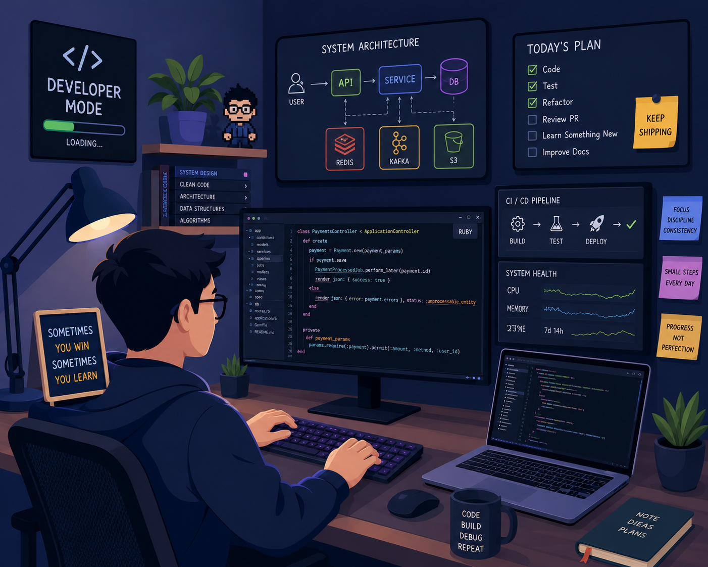

<h1 align="center">
Hi 👋 I'm Daniel Yosep
</h1>

**Hands-on Engineering Manager • Backend Engineer • Software Architect**

I enjoy building scalable backend systems, improving engineering practices, and still love writing production code.

Currently working across Ruby on Rails, PostgreSQL, Docker, Kafka and modern engineering workflows.

---

## 💡 What I Do

🏗 Design scalable backend architectures

💎 Build production-ready Ruby on Rails applications

🚀 Lead engineering teams while staying hands-on

⚡ Improve developer experience & CI/CD

📈 Optimize Query performance

🔍 Review code and mentor engineers

---

## ❤️ Primary Stack
### Backend


### Platform


### Database


### Frontend


## Also experienced with


---

## 🌱 Currently Exploring

- AI-assisted Software Development
- Agentic AI
- Event-Driven Architecture
- Developer Experience

---

## ⚡️ Insights Dashboard

### ⏱ WakaTime

<p align="center">
  <a href="https://wakatime.com/@aldanielyosep">
    
  </a>
  

  <a href="https://wakatime.com/@aldanielyosep">
      
  </a>
</p>

### 📈 Contribution Metrics (Public + Private Where Accessible)

<!--START_SECTION:profile-metrics-->

```txt
🧾 Commits Authored: 10125
🔀 Pull Requests Authored: 2311
👀 Code Reviews: 2547
✅ Approved Reviews: 2384
🔒 Restricted Private Contributions: 14961
🗓 Last Updated: 2026-07-01
```

<!--END_SECTION:profile-metrics-->
---

## 🐍 My Contributions

<p align="center">Snake animation is generated from my GitHub contribution graph.</p>

<div align="center">
  <picture>
    <source media="(prefers-color-scheme: dark)" srcset="https://raw.githubusercontent.com/aldanielyosep/aldanielyosep/output/github-contribution-grid-snake-dark.svg" />
    <source media="(prefers-color-scheme: light)" srcset="https://raw.githubusercontent.com/aldanielyosep/aldanielyosep/output/github-contribution-grid-snake.svg" />
    
  </picture>
</div>

---

## 📫 Connect
<div align="center">
  <a href="mailto:aldanielyosep@gmail.com">
    
  </a>
  <a href="https://linkedin.com/in/aldanielyosep" target="_blank">
    
  </a>
</div>